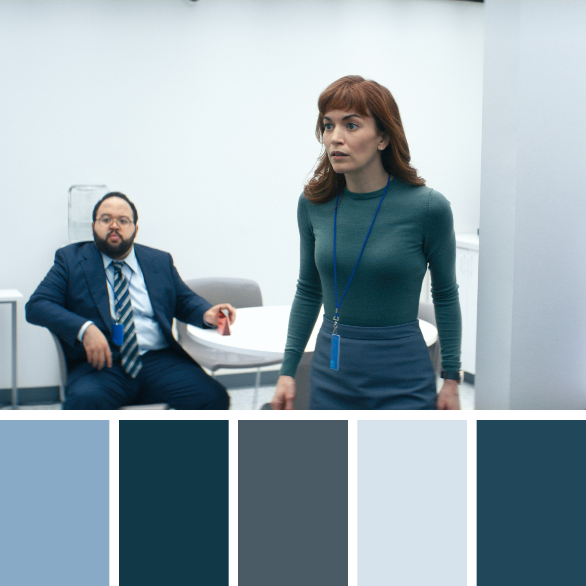
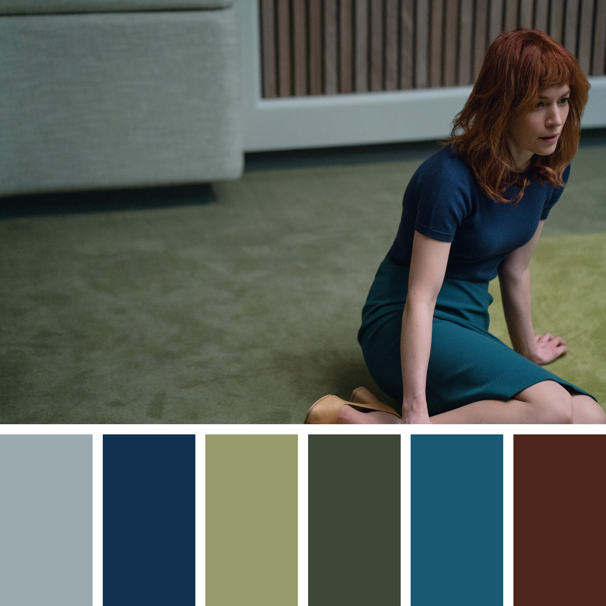
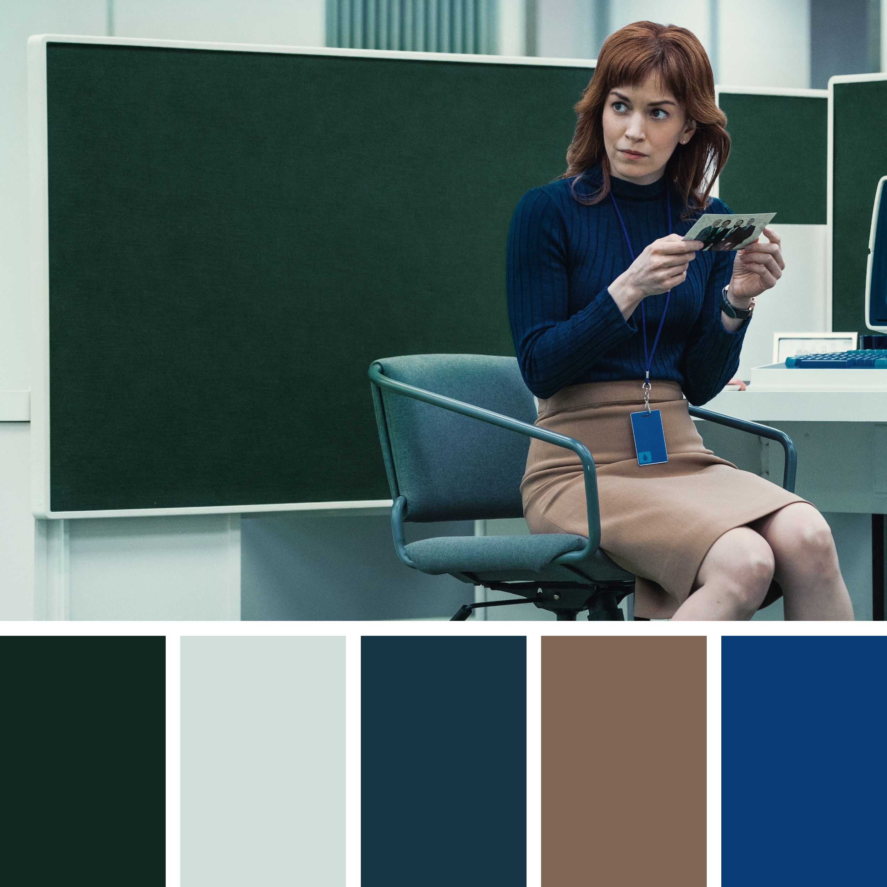
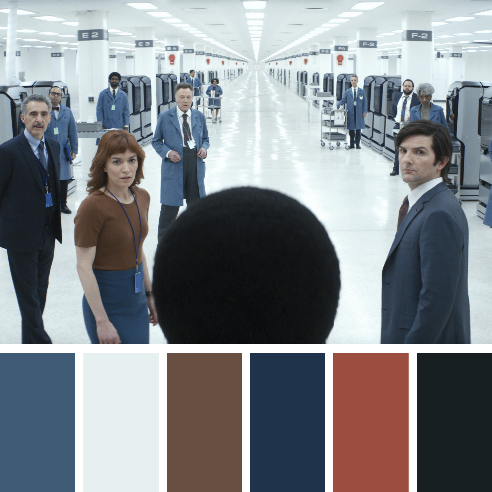
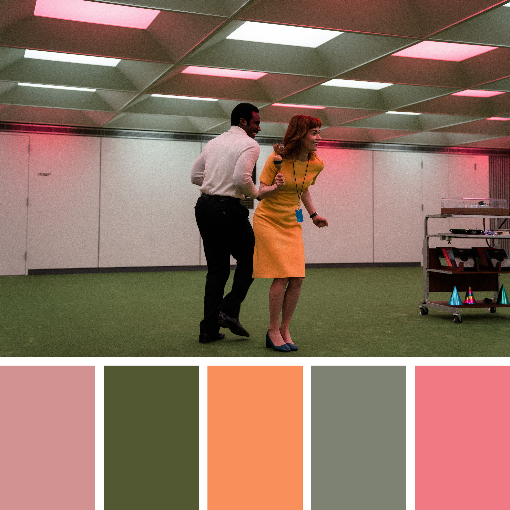

<!-- README.md is generated from README.Rmd. Please edit that file -->

```{r, include = FALSE}
knitr::opts_chunk$set(
  collapse = TRUE,
  comment = "#>",
  fig.path = "man/figures/README-",
  out.width = "100%"
)
```

# severance 

The severance package contains color palettes for R inspired by the show [Severance](https://tv.apple.com/us/show/severance/umc.cmc.1srk2goyh2q2zdxcx605w8vtx).

Images were sourced from the [Apple TV+ Press website](https://www.apple.com/tv-pr/originals/severance/episodes-images/). The structure of the package was based on the [MetBrewer package](https://github.com/BlakeRMills/MetBrewer) by Blake R. Mills and the [wesanderson package](https://github.com/karthik/wesanderson) by Karthik Ram.

* [Installation](#installation)
* [Examples](#examples)
* [Palettes](#palettes)
* [Notes](#notes)

## Installation

You can install the development version of severance from [GitHub](https://github.com/) with:

``` r
# install.packages("devtools")
devtools::install_github("ivelasq/severance")
```

## Examples

Here are examples of the severange package using [TidyTuesday data](https://github.com/rfordatascience/tidytuesday/blob/master/data/2021/2021-02-23/readme.md) from the Bureau of Labor Statistics. The plot is based on one created by Amanda Luby from the [Swarthmore College Data Visualization Group](https://aluby.domains.swarthmore.edu/sdv/posts/2021-03-05-bls-earnings-data/).

```{r plot-ref}
#| ref.label = "plot",
#| echo = FALSE,
#| message = FALSE,
#| dpi = 300,
#| fig.alt = "Three steamplots showing the gender disparity between races displayed in three different palettes from the severance package"
```

The code to reproduce the plot is below:

```{r}
#| label = "plot",
#| eval = FALSE
library(severance)
library(ggplot2)
library(cowplot)
library(dplyr)
library(tidyr)

earn <-
  readr::read_csv(
    'https://raw.githubusercontent.com/rfordatascience/tidytuesday/master/data/2021/2021-02-23/earn.csv'
  )

earn_clean <- earn %>%
  mutate(median_yearly = median_weekly_earn * 52) %>%
  filter(race != "All Races",
         sex != "Both Sexes") %>%
  group_by(race, sex, year, quarter) %>%
  summarize(median_salary = median(median_yearly)) %>%
  pivot_wider(
    id_cols = c("race", "year", "quarter"),
    names_from = sex,
    values_from = median_salary
  ) %>%
  group_by(race) %>%
  mutate(
    time = paste(year, quarter, sep = "-Q"),
    men_dev = Men - (Men + Women) / 2,
    women_dev = Women - (Men + Women) / 2,
    race = factor(race, levels = c(
      "Asian", "White", "Black or African American"
    ))
  )

p <-
  ggplot(earn_clean,
         aes(
           x = time,
           ymin = women_dev,
           ymax = men_dev,
           fill = race,
           group = race
         )) +
  geom_ribbon() +
  theme_void() +
  theme(legend.position = "none")

p1 <- p + scale_fill_manual(values = severance_palette("Jazz02"))
p2 <- p + scale_fill_manual(values = severance_palette("TheYouYouAre"))
p3 <- p + scale_fill_manual(values = severance_palette("Hell"))

title <- ggdraw() +
  draw_label(
    "The gender wage gap persists across Asian, Black, and White Americans",
    fontface = "bold",
    x = 0,
    hjust = 0
  ) +
  draw_label(
    "Original visualization by Amanda Luby, Swarthmore College",
    x = 0,
    vjust = 2.2,
    hjust = 0
  ) +
  theme(plot.margin = margin(0, 0, 0, 7))

prow <- plot_grid(
  p1,
  p2,
  p3,
  align = 'h',
  labels = c("Jazz02", "TheYouYouAre", "Hell"),
  hjust = 0,
  nrow = 1
)

caption <- ggdraw() +
  draw_label("Source: BLS Earnings Data",
             hjust = -0.3,
             vjust = -0.5)

plot_grid(title,
          prow,
          caption,
          ncol = 1,
          # rel_heights values control vertical title margins
          rel_heights = c(0.3, 1))
```

## Palettes

### Colorblind-friendly

---

#### Dinner


#### Hell


#### Jazz02


#### TheYouYouAre


### Not colorblind-friendly

---
#### HideAndSeek


#### Jazz01


## Notes

Thank you to the package developers of [MetBrewer package](https://github.com/BlakeRMills/MetBrewer), Blake R. Mills, and the [wesanderson package](https://github.com/karthik/wesanderson), Karthik Ram, for sharing their code.

Thank you to Amanda Luby from the [Swarthmore College Data Visualization Group](https://aluby.domains.swarthmore.edu/sdv/posts/2021-03-05-bls-earnings-data/) for sharing her data visualization.

Colorblind-friendliness was checked using the [Adobe Color Accessibility Wheel](https://color.adobe.com/create/color-accessibility).
